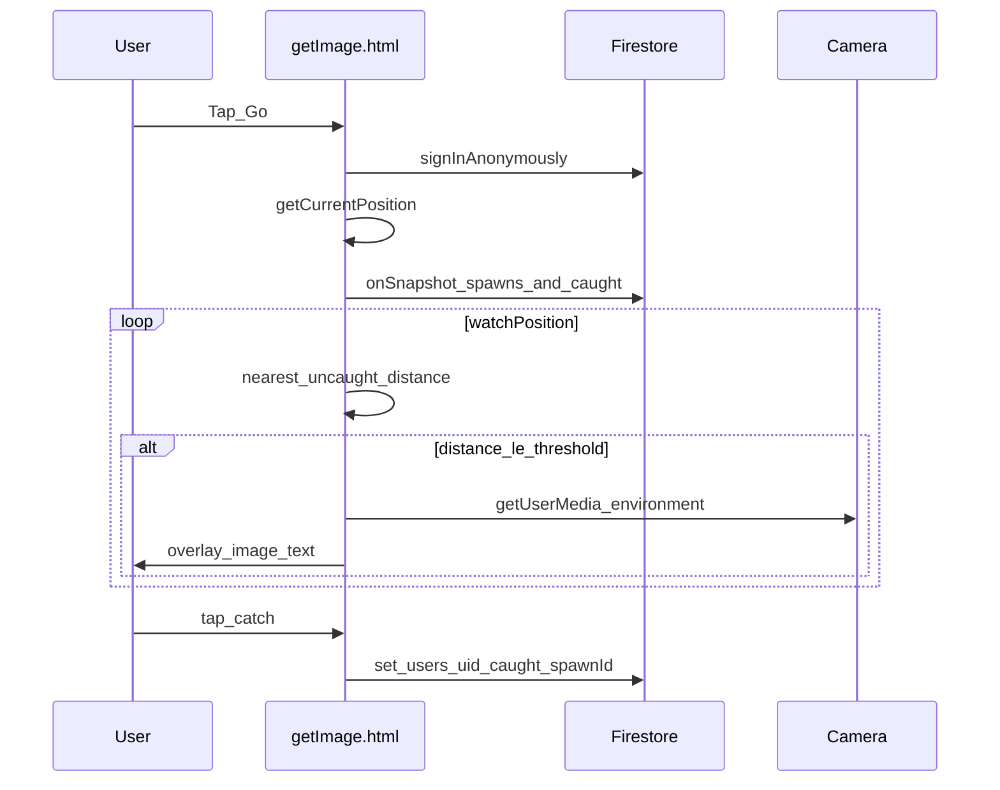

# 아키텍처

## 구성 요소

| 파일 | 역할 |
|------|------|
| `pGO/dataupload.html` | Leaflet 지도 + 위치 + Storage 업로드 + `spawns` 생성 |
| `pGO/getImage.html` | Go → 지도 + 근접 시 `<video>` + 오버레이 + 수집 |
| `pGO/js/firebase-config.js` | Firebase 웹 설정 |
| `pGO/js/pgo-common.js` | 앱 초기화, 익명 로그인, Haversine 거리 |
| `public/pGO` | `pGO/` 로 가는 심볼릭 링크 (Hosting 배포용) |

## 데이터 모델 (Firestore)

### `spawns/{spawnId}`

| 필드 | 타입 | 설명 |
|------|------|------|
| `lat`, `lng` | number | 등록 좌표 |
| `caption` | string | 표시 문구 (≤500자) |
| `imageUrl` | string | Storage 다운로드 URL |
| `imagePath` | string | `uploads/{uid}/…` (규칙 검증용) |
| `createdAt` | timestamp | 서버 시각 |
| `createdByUid` | string | 업로더 UID |
| `active` | bool | `true`만 조회 |

### `users/{uid}/caught/{spawnId}`

| 필드 | 타입 | 설명 |
|------|------|------|
| `spawnId` | string | 문서 ID와 동일 |
| `caption` | string | 수집 시점 스냅샷 |
| `imageUrl` | string | 수집 시점 스냅샷 |
| `caughtAt` | timestamp | 서버 시각 |

## 흐름 (플레이)

## 근접 판정

- Haversine 공식으로 사용자와 각 스폰 사이 거리(m) 계산 (`pgo-common.js`).
- 가장 가까운 **미수집** 스폰이 `PROXIMITY_M` 이내면 인카운터.
- 인카운터 중 거리가 `PROXIMITY_M * EXIT_MULT` 초과면 자동 종료(이탈).

## 스토리지

- 경로: `uploads/{auth.uid}/{timestamp}_{filename}`.
- MIME: `image/*`, 규칙상 5MB 미만.
